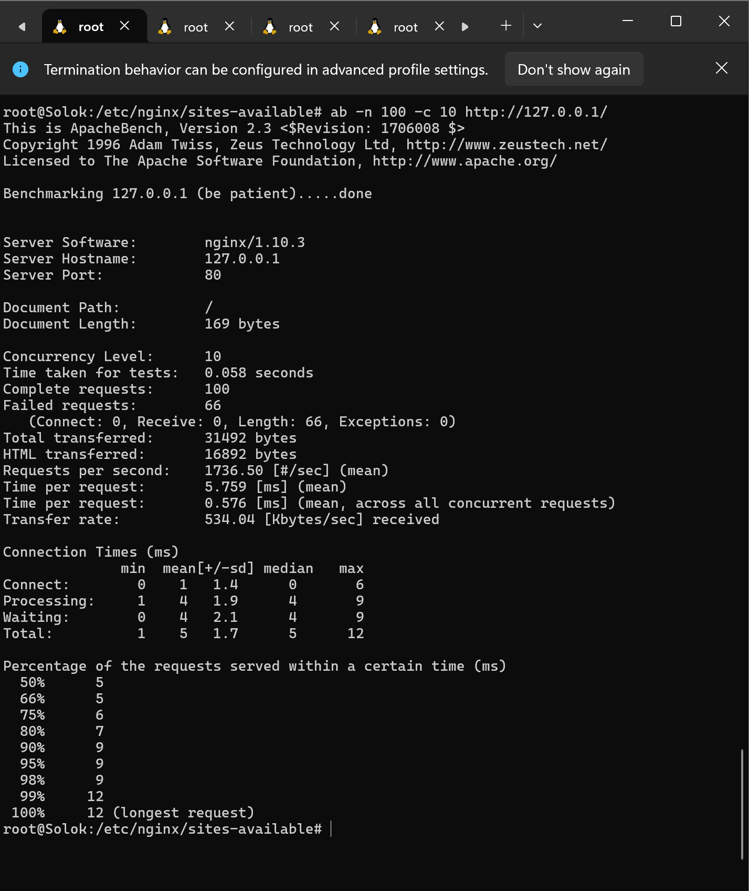
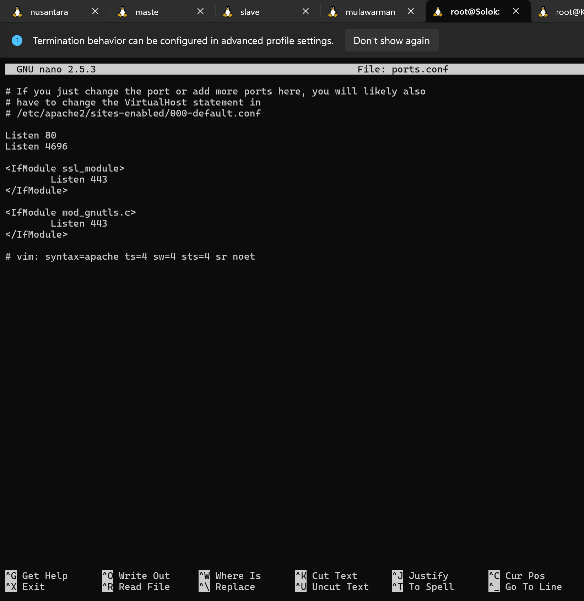
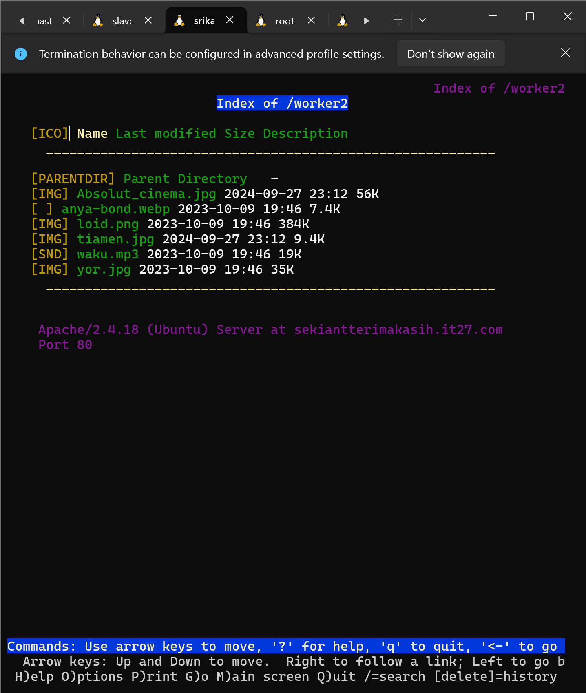

# Jarkom-Modul-2-IT27-2024

## IT 27

| No  | Nama Anggota          | NRP        |
| --- | --------------------- | ---------- |
| 1   | Danendra Fidel Khansa | 5027231063 |
| 2   | Farida Qurrotu A'yuna | 5027231015 |

## Topologi Kelompok IT27 Praktikum Modul 2


## SOAL 1

Untuk mempersiapkan peperangan World War MMXXIV (Iya sebanyak itu), Sriwijaya membuat dua kotanya menjadi web server yaitu Tanjungkulai, dan Bedahulu, serta Sriwijaya sendiri akan menjadi DNS Master. Kemudian karena merasa terdesak, Majapahit memberikan bantuan dan menjadikan kerajaannya (Majapahit) menjadi DNS Slave.

### Router (Nusantara)

Pada topologi ini router terhubung dengan 2 switch

```
auto eth0
iface eth0 inet dhcp

auto eth1
iface eth1 inet static
  address 10.77.1.1
  netmask 255.255.255.0

auto eth2
iface eth2 inet static
  address 10.77.2.1
  netmask 255.255.255.0

up iptables -t nat -A POSTROUTING -o eth0 -j MASQUERADE -s 10.77.0.0/16
```

### Sriwijaya (DNS Master)

Setup untuk bind9

```
auto eth0
iface  eth0 inet static
  address 10.77.2.5
  netmask 255.255.255.0
  gateway 10.77.2.1

up echo nameserver 192.168.122.1 > /etc/resolv.conf
```

### Majapahit (DNS Slave)

Setup untuk bind9

```
auto eth0
iface  eth0 inet static
  address 10.77.1.2
  netmask 255.255.255.0
  gateway 10.77.1.1

up echo nameserver 192.168.122.1 > /etc/resolv.conf
```

### Mulawarman (CLient)

Set untuk nameserver DNS Master dan Slave

```
auto eth0
iface  eth0 inet static
  address 10.77.1.3
  netmask 255.255.255.0
  gateway 10.77.1.1

up echo nameserver 10.77.1.2 > /etc/resolv.conf
up echo nameserver 10.77.2.5 >> /etc/resolv.conf
up echo nameserver 192.168.122.1 >>  /etc/resolv.conf

```

### GrahamBell (Client)

Set untuk nameserver DNS Master dan Slave

```
auto eth0
iface  eth0 inet static
  address 10.77.1.4
  netmask 255.255.255.0
  gateway 10.77.1.1

up echo nameserver 10.77.1.2 > /etc/resolv.conf
up echo nameserver 10.77.2.5 >> /etc/resolv.conf
up echo nameserver 192.168.122.1 >>  /etc/resolv.conf

```

### Samaratungga (Client)

Set untuk nameserver DNS Master dan Slave

```
auto eth0
iface  eth0 inet static
  address 10.77.1.5
  netmask 255.255.255.0
  gateway 10.77.1.1

up echo nameserver 10.77.1.2 > /etc/resolv.conf
up echo nameserver 10.77.2.5 >> /etc/resolv.conf
up echo nameserver 192.168.122.1 >>  /etc/resolv.conf

```

### Srikandi (Client)

Set untuk nameserver DNS Master dan Slave

```
auto eth0
iface  eth0 inet static
  address 10.77.2.3
  netmask 255.255.255.0
  gateway 10.77.2.1

up echo nameserver 10.77.1.2 > /etc/resolv.conf
up echo nameserver 10.77.2.5 >> /etc/resolv.conf
up echo nameserver 192.168.122.1 >>  /etc/resolv.conf

```

### Kotalingga (Web Server)

```
auto eth0
iface  eth0 inet static
  address 10.77.2.4
  netmask 255.255.255.0
  gateway 10.77.2.1

up echo nameserver 10.77.1.2 > /etc/resolv.conf
up echo nameserver 10.77.2.5 >> /etc/resolv.conf
up echo nameserver 192.168.122.1 >>  /etc/resolv.conf

```

### Tanjungkulai (Web Server)

```
auto eth0
iface  eth0 inet static
  address 10.77.2.6
  netmask 255.255.255.0
  gateway 10.77.2.1

up echo nameserver 10.77.1.2 > /etc/resolv.conf
up echo nameserver 10.77.2.5 >> /etc/resolv.conf
up echo nameserver 192.168.122.1 >>  /etc/resolv.conf

```

### Bedahulu (Web Server)

```
auto eth0
iface  eth0 inet static
  address 10.77.2.7
  netmask 255.255.255.0
  gateway 10.77.2.1

up echo nameserver 10.77.1.2 > /etc/resolv.conf
up echo nameserver 10.77.2.5 >> /etc/resolv.conf
up echo nameserver 192.168.122.1 >>  /etc/resolv.conf

```

### Solok (Load Balancer)

```
auto eth0
iface  eth0 inet static
  address 10.77.2.2
  netmask 255.255.255.0
  gateway 10.77.2.1

up echo nameserver 192.168.122.1 > /etc/resolv.conf
```

- Gunakan `iptables -t nat -A POSTROUTING -o eth0 -j MASQUERADE -s 10.77.0.0/16` untuk memulai ping pada seluruh client pada Nusantara

## SOAL 2

Karena para pasukan membutuhkan koordinasi untuk melancarkan serangannya, maka buatlah sebuah domain yang mengarah ke Solok dengan alamat sudarsana.xxxx.com dengan alias www.sudarsana.xxxx.com, dimana xxxx merupakan kode kelompok. Contoh: sudarsana.it01.com.

- Instal bind pada DNS Master

```
apt-get update
apt-get install bind9 -y
```

- Kemudian `nano /etc/bind/named.conf.local` untuk mengsetup domain `sudarsana.it27.com`

```
zone "sudarsana.it27.com" {
        type master;
        file "/etc/bind/it27/sudarsana.it27.com";
};
```

- Buat direktori `/etc/bind/it27` dan cp `cp /etc/bind/db.local /etc/bind/it27/sudarsana.it27.com` untuk mengatur bind9nya

- Kemudian masuk ke `cd /etc/bind/it27`

- Edit confignya `nano sudarsana.it27.com`

```
;
; BIND data file for local loopback interface
;
$TTL    604800
@       IN      SOA      sudarsana.it27.com. root. sudarsana.it27.com. (
                              2         ; Serial
                         604800         ; Refresh
                          86400         ; Retry
                        2419200         ; Expire
                         604800 )       ; Negative Cache TTL
;
@       IN      NS      sudarsana.it27.com.
@       IN      A       10.77.2.2
@       IN      AAAA    ::1
www     IN      CNAME   sudarsana.it27.com.
```

- Jalankan file confignya `./sudarsana.it27.com`

- Restart dengan `service bind9 restart`

- Ping pada client dengan memasukkan `ping www.sudarsana.it27.com` atau `ping sudarsana.it27.com`


## SOAL 3

Para pasukan juga perlu mengetahui mana titik yang akan diserang, sehingga dibutuhkan domain lain yaitu pasopati.xxxx.com dengan alias www.pasopati.xxxx.com yang mengarah ke Kotalingga.

- `nano /etc/bind/named.conf.local` untuk mengsetup domain `pasopati.it27.com` pada DNS Master

```
zone "pasopati.it27.com" {
        type master;
        file "/etc/bind/it27/pasopati.it27.com";
};
```

- cp `cp /etc/bind/db.local /etc/bind/it27/pasopati.it27.com` untuk mengatur bind9nya

- Kemudian masuk ke `cd /etc/bind/it27`

- Edit confignya `nano pasopati.it27.com`

```
;
; BIND data file for local loopback interface
;
$TTL    604800
@       IN      SOA     pasopati.it27.com. root.pasopati.it27.com. (
                              2         ; Serial
                         604800         ; Refresh
                          86400         ; Retry
                        2419200         ; Expire
                         604800 )       ; Negative Cache TTL
;
@       IN      NS      pasopati.it27.com.
@       IN      A       10.77.2.4
@       IN      AAAA    ::1
www     IN      CNAME   pasopati.it27.com.
```

- Jalankan file confignya `./pasopati.it27.com`

- Restart dengan `service bind9 restart`

- Ping pada client dengan memasukkan `ping www.pasopati.it27.com`


## SOAL 4

Markas pusat meminta dibuatnya domain khusus untuk menaruh informasi persenjataan dan suplai yang tersebar. Informasi dan suplai meme terbaru tersebut mengarah ke Tanjungkulai dan domain yang ingin digunakan adalah rujapala.xxxx.com dengan alias www.rujapala.xxxx.com.

- `nano /etc/bind/named.conf.local` untuk mengsetup domain `rujapala.it27.com` pada DNS Master

```
zone "rujapala.it27.com" {
        type master;
        file "/etc/bind/it27/rujapala.it27.com";
};
```

- cp `cp /etc/bind/db.local /etc/bind/it27/rujapala.it27.com` untuk mengatur bind9nya

- Kemudian masuk ke `cd /etc/bind/it27`

- Edit confignya `nano rujapala.it27.com`

```
;
; BIND data file for local loopback interface
;
$TTL    604800
@       IN      SOA     rujapala.it27.com. root.rujapala.it27.com. (
                              2         ; Serial
                         604800         ; Refresh
                          86400         ; Retry
                        2419200         ; Expire
                         604800 )       ; Negative Cache TTL
;
@       IN      NS      rujapala.it27.com.
@       IN      A       10.77.2.6
@       IN      AAAA    ::1
www     IN      CNAME   rujapala.it27.com.
```

- Jalankan file confignya `./rujapala.it27.com`

- Restart dengan `service bind9 restart`

- Ping pada client dengan memasukkan `ping www.rujapala.it27.com`


## SOAL 5

Pastikan domain-domain tersebut dapat diakses oleh seluruh komputer (client) yang berada di Nusantara.

- Tambahkan nameserver prefix ip `10.77.2.5` pada `etc/resolv.conf` pada seluruh client atau disetup pada konfigurasi GNSnya memakai

```

up echo nameserver 10.77.2.5 > /etc/resolv.conf
up echo nameserver 10.77.1.2>> /etc/resolv.conf

```

`10.77.2.5` untuk prefix ip DNS Master `10.77.1.2` untuk prefix ip DNS Slave

.png>)

- Testing pada client untuk mengeceknya

```

ping www.sudarsana.it27.com
ping www.pasopati.it27.com
ping.www.rujapala.it27.com

```


## SOAL 6

Beberapa daerah memiliki keterbatasan yang menyebabkan hanya dapat mengakses domain secara langsung melalui alamat IP domain tersebut. Karena daerah tersebut tidak diketahui secara spesifik, pastikan semua komputer (client) dapat mengakses domain pasopati.xxxx.com melalui alamat IP Kotalingga (Notes: menggunakan pointer record).

- Edit untuk DNS Master `/etc/bind/named.conf.local` nambahin PTR

```
zone "2.77.10.in-addr.arpa" {
        type master;
        notify yes;
        also-notify { 10.77.1.2;};
        file "/etc/bind/it27/2.77.10.in-addr.arpa";
};
```

- Copy `cp /etc/bind/db.local /etc/bind/it27/2.77.10.in-addr.arpa`

- cd ke `/etc/bind/it27` lalu edit `nano 2.77.10.in-addr.arpa` tambahin yang dibawah itu

```

;
; BIND data file for local loopback interface
;
$TTL    604800
@       IN      SOA     pasopati.it27.com. root.pasopati.it27.com. (
                              2         ; Serial
                         604800         ; Refresh
                          86400         ; Retry
                        2419200         ; Expire
                         604800 )       ; Negative Cache TTL
;
2.77.10.in-addr.arpa.   IN      NS      pasopati.it27.com.
4                       IN      PTR     pasopati.it27.com.
```

- Restart `service bind9 restart`

- Testing pada client dengan `host -t PTR 10.77.2.4`


## SOAL 7

Akhir-akhir ini seringkali terjadi serangan brainrot ke DNS Server Utama, sebagai tindakan antisipasi kamu diperintahkan untuk membuat DNS Slave di Majapahit untuk semua domain yang sudah dibuat sebelumnya yang mengarah ke Sriwijaya.

- Pada DNS Master (Sriwijaya) edit `/etc/bind/named.conf.local` untuk `notify` dan `also-notify`

```
zone "sudarsana.it27.com" {
    type master;
    notify yes;
    also-notify { 10.77.1.2;};
    file "/etc/bind/it27/sudarsana.it27.com";
};

zone "pasopati.it27.com" {
    type master;
    notify yes;
    also-notify { 10.77.1.2;};
    file "/etc/bind/it27/pasopati.it27.com";
};

zone "rujapala.it27.com" {
    type master;
    notify yes;
    also-notify { 10.77.1.2;};
    file "/etc/bind/it27/rujapala.it27.com";
};

zone "2.77.10.in-addr.arpa" {
    type master;
    notify yes;
    also-notify { 10.77.1.2;};
    file "/etc/bind/it27/2.77.10.in-addr.arpa";
};
```

- Pada DNS Slave (Majapahit) install bind seperti DNS Master (Sriwijaya)

```
apt-get update
apt-get install bind9 -y
```

- Kemudian pada DNS Slave (Majapahit) edit `/etc/bind/named.conf.local` untuk type `slave`

```
zone "sudarsana.it27.com" {
    type slave;
    masters {10.77.2.5;};
    file "/var/lib/bind/it27/sudarsana.it27.com";
};

zone "pasopati.it27.com" {
    type slave;
    masters {10.77.2.5;};
    file "/var/lib/bind/it27/pasopati.it27.com";
};

zone "rujapala.it27.com" {
    type slave;
    masters {10.77.2.5;};
    file "/var/lib/bind/it27/rujapala.it27.com";
};

zone "2.77.10.in-addr.arpa" {
    type slave;
    masters {10.77.2.5;};
    file "/var/lib/bind/it27/2.77.10.in-addr.arpa";
};
```

- Matikan bind9 pada DNS Master (Sriwijaya) `service bind9 stop` dan cek status bind9 `service bind9 status`


- Kemudian nyalakan bind9 pada DNS Slave (Majapahit) `service bind9 restart`

.png>)

- Ping pada client misal `ping sudarsana.it27.com` untuk membuktikan DNS Slave berjalan

.png>)

## SOAL 8

Kamu juga diperintahkan untuk membuat subdomain khusus melacak kekuatan tersembunyi di Ohio dengan subdomain cakra.sudarsana.xxxx.com yang mengarah ke Bedahulu.

- Setup pada DNS Master `/etc/bind/it27/sudarsana.it27.com`

```
;
; BIND data file for local loopback interface
;
$TTL    604800
@       IN      SOA     sudarsana.it27.com. root.sudarsana.it27.com. (
                              2         ; Serial
                         604800         ; Refresh
                          86400         ; Retry
                        2419200         ; Expire
                         604800 )       ; Negative Cache TTL
;
@       IN      NS      sudarsana.it27.com.
@       IN      A       10.77.2.2
@       IN      AAAA    ::1
www     IN      CNAME   sudarsana.it27.com.
cakra   IN      A       10.77.2.7
```

- Restart service bind9 di DNS Master `service bind9 restart`


- Testing subdomain `cakra.sudarsana.it27.com` di client

  .png>)

## SOAL 9

Karena terjadi serangan DDOS oleh shikanoko nokonoko koshitantan (NUN), sehingga sistem komunikasinya terhalang. Untuk melindungi warga, kita diperlukan untuk membuat sistem peringatan dari siren man oleh Frekuensi Freak dan memasukkannya ke subdomain panah.pasopati.xxxx.com dalam folder panah dan pastikan dapat diakses secara mudah dengan menambahkan alias www.panah.pasopati.xxxx.com dan mendelegasikan subdomain tersebut ke Majapahit dengan alamat IP menuju radar di Kotalingga.

- Setup pada DNS Master (Sriwijaya) ` /etc/bind/it27` untuk nambahin subdomain

```
;
; BIND data file for local loopback interface
;
$TTL    604800
@       IN      SOA     pasopati.it27.com. root.pasopati.it27.com. (
                              2         ; Serial
                         604800         ; Refresh
                          86400         ; Retry
                        2419200         ; Expire
                         604800 )       ; Negative Cache TTL
;
@       IN      NS      pasopati.it27.com.
@       IN      A       10.77.2.4
@       IN      AAAA    ::1
www     IN      CNAME   pasopati.it27.com.
ns1     IN      A       10.77.1.2
panah   IN      NS      ns1
```

- Pada DNS Master (Sriwijaya) edit bagian optionnya `/etc/bind/named.conf.options`

```

options {
directory "/var/cache/bind";
//dnssec-validation auto;
allow-query{any;};

    auth-nxdomain no;    # conform to RFC1035
    listen-on-v6 { any; };

};

```

- Kemudian restart service bind9 `service bind9 restart`

- Kemudian pada DNS Slave (Majapahit) setup `nano /etc/bind/named.conf.local` tambahkan untuk subdomain `panah.pasopati.it27.com`

```

zone "sudarsana.it27.com" {
    type slave;
    masters {10.77.2.5;};
    file "/var/lib/bind/it27/sudarsana.it27.com";
};

zone "pasopati.it27.com" {
    type slave;
    masters {10.77.2.5;};
    file "/var/lib/bind/it27/pasopati.it27.com";
};

zone "rujapala.it27.com" {
    type slave;
    masters {10.77.2.5;};
    file "/var/lib/bind/it27/rujapala.it27.com";
};
zone "2.77.10.in-addr.arpa" {
    type slave;
    masters {10.77.2.5;};
    file "/var/lib/bind/it27/2.77.10.in-addr.arpa";
};
zone "panah.pasopati.it27.com" {
    type master;
    file "/etc/bind/panah/panah.pasopati.it27.com";
};

```

- Buat direktori panah `/etc/bind/panah`

- Lalu cp `cp /etc/bind/db.local /etc/bind/panah/panah.pasopati.it27.com`

.png>)

- Edit `named.conf.local` untuk nambahin subdomainnya seperti dibawah pada DNS Slave

```
;
; BIND data file for local loopback interface
;
$TTL    604800
@       IN      SOA     panah.pasopati.it27.com. root.panah.pasopati.it27.com. (
                              2         ; Serial
                         604800         ; Refresh
                          86400         ; Retry
                        2419200         ; Expire
                         604800 )       ; Negative Cache TTL
;
@       IN      NS      panah.pasopati.it27.com.
@       IN      A       10.77.2.4
@       IN      AAAA    ::1
www     IN      CNAME   panah.pasopati.it27.com

```

- Restart bind9 `service bind9 restart`

- `ping panah.pasopati.it27.com` pada client

.png>)

## SOAL 10

Markas juga meminta catatan kapan saja meme brain rot akan dijatuhkan, maka buatlah subdomain baru di subdomain panah yaitu log.panah.pasopati.xxxx.com serta aliasnya www.log.panah.pasopati.xxxx.com yang juga mengarah ke Kotalingga.

- Masuk kedalam `cd /etc/bind/panah/panah.pasopati.it27.com` pada DNS Slave

- Tambahkan subdomain lognya

```
;
; BIND data file for local loopback interface
;
$TTL    604800
@       IN      SOA     panah.pasopati.it27.com. root.panah.pasopati.it27.com. (
                              2         ; Serial
                         604800         ; Refresh
                          86400         ; Retry
                        2419200         ; Expire
                         604800 )       ; Negative Cache TTL
;
@       IN      NS      log.panah.pasopati.it27.com.
@       IN      A       10.77.2.4
@       IN      AAAA    ::1
www     IN      CNAME   panah.pasopati.it27.com
log     IN      A       10.67.2.4
www.log IN      CNAME   panah.pasopati.it07.com.
```

- Restart dengan `service bind9 restart`

- Ping pada client `ping log.panah.pasopati.it27.com`


## SOAL 11

Setelah pertempuran mereda, warga IT dapat kembali mengakses jaringan luar dan menikmati meme brainrot terbaru, tetapi hanya warga Majapahit saja yang dapat mengakses jaringan luar secara langsung. Buatlah konfigurasi agar warga IT yang berada diluar Majapahit dapat mengakses jaringan luar melalui DNS Server Majapahit.

- Edit `/etc/bind/named.conf.options` pada DNS Master

.png>)

```
options {
    directory "/var/cache/bind";

    forwarders {
        192.168.122.1;
    }

    //dnssec-validation auto;
    allow-query{any;};

    auth-nxdomain no;    # conform to RFC1035
    listen-on-v6 { any; };
};
```

- Restart `service bind9 restart`
- Ping pada client `ping google.com`

.png>)

## SOAL 12

Karena pusat ingin sebuah laman web yang ingin digunakan untuk memantau kondisi kota lainnya maka deploy laman web ini (cek resource yg lb) pada Kotalingga menggunakan apache.

- Tambahkan IP Kotalingga di DNS Master dan DNS Slave
- Buat file config di tipa client nya

```
#!/bin/bash
# Cek apakah lynx sudah terinstal
if ! command -v named &> /dev/null
then
    echo "Lynx belum terinstal, melakukan instalasi..."
    # Melakukan instalasi lynx
    apt-get update
    apt-get install lynx -y
else
    echo "lynx sudah terinstal."
fi

```

- Buat file config pada WebServer Kotalingga

```
#!/bin/bash
# Cek apakah apache2 sudah terinstal
if ! command -v apache2 &> /dev/null
then
    echo "Apache2 belum terinstal, melakukan instalasi..."
    # Melakukan instalasi apache2
    apt-get update
    apt-get install apache2 -y
    apt-get install libapache2-mod-php -y
else
    echo "Apache2 sudah terinstal."
fi

# Cek apakah unzip sudah terinstal
if ! command -v unzip &> /dev/null
then
    echo "Unzip belum terinstal, melakukan instalasi..."
    # Melakukan instalasi unzip
    apt-get update
    apt-get install unzip -y
else
    echo "Unzip sudah terinstal."
fi

# Cek apakah PHP sudah terinstal
if ! command -v php &> /dev/null
then
    echo "PHP belum terinstal, melakukan instalasi..."
    # Melakukan instalasi php
    apt-get update
    apt-get install php -y
else
    echo "PHP sudah terinstal."
fi

# Download file lb.zip
echo "Mengunduh lb.zip..."
curl -L -o lb.zip --insecure "https://drive.google.com/uc?export=download&id=1xn03kTB27K872cokqwEIlk8Zb121HnfB"

# Cek apakah unduhan berhasil
if [ ! -f lb.zip ]; then
    echo "Download gagal atau file tidak ada."
    exit 1
fi

# Unzip file lb.zip
echo "Mengekstrak lb.zip..."
unzip lb.zip || { echo "Ekstraksi gagal"; exit 1; }

# Hapus file template
echo "Menghapus file template..."
rm -rf /var/www/html/index.php

# Copy file index.php
if [ -d "worker" ] && [ -f "worker/index.php" ]; then
    echo "Menyalin file index.php..."
    cp worker/index.php /var/www/html/index.php
else
    echo "File 'worker/index.php' tidak ditemukan. Pastikan file ada setelah ekstraksi."
    exit 1
fi

# Restart layanan Apache
echo "Merestart layanan Apache..."
service apache2 restart

# Tambahkan ServerName ke konfigurasi Apache untuk menghindari peringatan
if ! grep -q "ServerName localhost" /etc/apache2/apache2.conf; then
    echo "Menambahkan ServerName ke konfigurasi Apache..."
    echo "ServerName localhost" >> /etc/apache2/apache2.conf
fi

echo "Skrip selesai dijalankan."
```

- Jalankan semua file confignya (Client dan Kotalingga)

  

- Jalankan testing di tiap client

  ```
  lynx http://10.77.2.4/index.php
  ```

  

# REVISI

## SOAL 13

Karena Sriwijaya dan Majapahit memenangkan pertempuran ini dan memiliki banyak uang dari hasil penjarahan (sebanyak 35 juta, belum dipotong pajak) maka pusat meminta kita memasang load balancer untuk membagikan uangnya pada web nya, dengan Kotalingga, Bedahulu, Tanjungkulai sebagai worker dan Solok sebagai Load Balancer menggunakan apache sebagai web server nya dan load balancer nya.

- Sebelum itu siapkan pada ketiga web server

```
apt install lynx unzip apache2 libapache2-mod-wsgi python-dev libapache2-mod-php7.0 -y
```

- Kemudian `/var/www/html/index.php` lalu masukkan untuk ketiga webserver

```
<?php
$hostname = gethostname();
$date = date('Y-m-d H:i:s');
$php_version = phpversion();
$username = get_current_user();


echo "Hello World!<br>";
echo "Saya adalah: $username<br>";
echo "Saat ini berada di: $hostname<br>";
echo "Versi PHP yang saya gunakan: $php_version<br>";
echo "Tanggal saat ini: $date<br>";
?>
```

- Lalu `rm /var/www/html/index.html` pada semua webserver

- start apache `service apache2 start` kesemua web server

- `lynx localhost` ke ke-3 web server

- Kemudian masuk Ke LB Solok dan install

```
apt install lynx apache2 apache2-utils php7.0 php7.0-fpm -y
```

- Lalu command

```
a2enmod proxy proxy_balancer proxy_http lbmethod_byrequests lbmethod_bytraffic lbmethod_bybusyness rewrite
```

- Masuk ke `cd /etc/apache2/sites-available`

- Lalu `nano 000-default.conf` tambahkan proxy balancernya untuk masing" web server

```
<VirtualHost *:80>

        ServerAdmin webmaster@localhost
        DocumentRoot /var/www/html

        <Proxy "balancer://workers">
                BalancerMember http://10.77.2.4
                BalancerMember http://10.77.2.6
                BalancerMember http://10.77.2.7
        ProxySet lbmethod=byrequests
        </Proxy>

        ProxyPass "/" "balancer://workers"
        ProxyPassReverse "/" "balancer://workers"

        ErrorLog ${APACHE_LOG_DIR}/error.log
        CustomLog ${APACHE_LOG_DIR}/access.log combined

</VirtualHost>
```

- Lalu `service apache2 start`

- `lynx localhost` pada lb solok untuk mengecek lb nya apakah berhasil


## SOAL 14

Selama melakukan penjarahan mereka melihat bagaimana web server luar negeri, hal ini membuat mereka iri, dengki, sirik dan ingin flexing sehingga meminta agar web server dan load balancer nya diubah menjadi nginx.

- Abis no 15 tadi lanjutin ke sini
- Masuk Solok trus run 1 1

```
service apache2 stop
apt install nginx -y
cd /etc/nginx/sites-available
unlink /etc/nginx/sites-enabled/default
```

- `nano load-balancer` isi dengan

```
upstream workers {
        server 10.77.2.4;
        server 10.77.2.6;
        server 10.77.2.7;
}

server {
        listen 80;
        server_name 10.77.2.2;

        location / {
        proxy_pass http://workers;
        }
}
```

- `ln -s /etc/nginx/sites-available/load-balancer /etc/nginx/sites-enabled/`

- `service nginx start` start

- Masuk ke web server dari Tanjungkulai, Bedahulu, Kotalingga

```
apt install nginx php7.0 php7.0-fpm -y
cd /etc/nginx/sites-available
```

- `nano web` isi

```
server {
  listen 80;

  root /var/www/html;

  index index.php index.html index.htm;

  server_name _;

  location / {
    try_files $uri $uri/ /index.php?$query_string;
  }

  location ~ \.php$ {
    include snippets/fastcgi-php.conf;
    fastcgi_pass unix:/var/run/php/php7.0-fpm.sock;
  }

  location ~ /\.ht {
    deny all;
  }

  error_log /var/log/nginx/web_error.log;
  access_log /var/log/nginx/web_access.log;


}
```

- `unlink /etc/nginx/sites-enabled/default`

- `ln -s /etc/nginx/sites-available/web /etc/nginx/sites-enabled/`

- atur apache dan nginx

```
service apache2 stop
service nginx start
service php7.0-fpm start
```

- Kembali ke nomer 15 buat lanjutin benchmark test yang nginx setelah benchmark test apache

## SOAL 15

Markas pusat meminta laporan hasil benchmark dengan menggunakan apache benchmark dari load balancer dengan 2 web server yang berbeda tersebut dan meminta secara detail dengan ketentuan:

- Nama Algoritma Load Balancer
- Report hasil testing apache benchmark
- Grafik request per second untuk masing masing algoritma.
- Analisis
- Meme terbaik kalian (terserah ( ͡° ͜ʖ ͡°)) 🤓

### PENGERJAAN :

- Masuk ke Solok

- Benchmark load balancer apache2 dengan algoritma defaultnya (byrequests) `ab -n 100 -c 10 http://127.0.0.1/`


- Ganti Algoritmanya `cd /etc/apache2/ sites-available` kemudian `nano 000-default.con` Pada `ProxySet` gunakan `bytraffic`


- Lalu `service apache2 restart`

- Test lagi ke `ab -n 100 -c 10 http://127.0.0.1/`


- Lalu ganti lagi ke `nano 000-default.conf` `ProxySet` pake `bybusyness`

- Test pake `ab -n 100 -c 10 http://127.0.0.1/`


- Save hasil benchmark apache2

- Ganti service LBnya ke nginx seperti di nomer 14 buat test benchmarknya (LANJUTAN NO 14)

- Masuk Solok buat test benchmark nginx sama kayak apache

- Benchmark `ab -n 100 -c 10 http://127.0.0.1/` terus simpan
- `nano /etc/nginx/sites-available/web` tambah `least_common;` untuk cek metode ke-2 nginx

- benchmark kembali `ab -n 100 -c 10 http://127.0.0.1/` simpan hasil benchmark untuk nginxnya



## SOAL 16

Karena dirasa kurang aman dari brainrot karena masih memakai IP, markas ingin akses ke Solok memakai solok.xxxx.com dengan alias www.solok.xxxx.com (sesuai web server terbaik hasil analisis kalian).

- Masuk ke console Sriwijaya lalu `cd /etc/bind/it27`

- edit `nano named.conf.local` untuk menambahkan zone baru


- Kemudian `cd it27` lalu `cp sudarsana.it27.com solok.it27.com` dan ganti nama domainnya


- Kemudian `service bind9 restart`

- Pindah ke Solok `cd /etc/apache2/sites-available` dan `cp 000-default.conf solok.it27.com.conf`

- `nano solok.it27.com.conf` ganti ServerName dan Aliasnya


- Kemudian mundur dan `cd ..` lalu `nano apache2.conf` tambahkan `ServerName solok.it27.com` kemudian `service apache2 restart`

- Masuk ke client, cek `cat /etc/resolv.conf` dan jangan lupa untuk `apt install lynx` untuk mengetes lb nya pada client dengan `lynx solok.it27.com`
  


## SOAL 17

Agar aman, buatlah konfigurasi agar solok.xxx.com hanya dapat diakses melalui port sebesar π x 10^4 = (phi nya desimal) dan 2000 + 2000 log 10 (10) +700 - π = ?.

- Ke WebServer Solok kemudian, dari perhitungan tesebut didapatkan `4696` untuk portnya kemudian edit `nano /etc/apache2/ports.conf` tambahkan `listen 4696`



- Kemudian pada `nano /etc/apache2/sites-avaible/solok.it27.com.conf` ganti ke `VirtualHost *=4696`


- Kemudian restart `service apache2 restart` pada Solok

- Coba pada client `lynx solok.it27.com:4696` maka loadbalancer akan jalan
  

## SOAL 18

Apa bila ada yang mencoba mengakses IP solok akan secara otomatis dialihkan ke www.solok.xxxx.com.

- Masuk ke Solok `cd /etc/apache2/sites-available`

- Buat `redirect.conf` isikan

```

<VirtualHost \*:80>
ErrorLog ${APACHE_LOG_DIR}/error.log
CustomLog ${APACHE_LOG_DIR}/access.log combined

        RewriteEngine On
        RewriteRule ^(.*)$ http://solok.it27.com:4696/$1 [R=301,L]

</VirtualHost>

# vim: syntax=apache ts=4 sw=4 sts=4 sr noet

```

- `a2enmod rewrite`
- `a2dissite 000-default.conf`
- `service apache2 reload`
- `service apache2 restart`
- Test ke client `lynx 10.77.2.2`


## SOAL 19

Karena probset sudah kehabisan ide masuk ke salah satu worker buatkan akses direktori listing yang mengarah ke resource worker2.

## SOAL 20

Worker tersebut harus dapat di akses dengan sekiantterimakasih.xxxx.com dengan alias www.sekiantterimakasih.xxxx.com.

### PENGERJAAN SOAL 19 DAN 20

- Masuk ke web server bebas (Kotalingga)`cd /etc/apache2/sites-available`

- `nano sekiantterimakasih.it27.com.conf` dan isinya

```

<VirtualHost \*:80>

        ServerName sekiantterimakasih.it27.com
        ServerAlias www.sekiantterimakasih.it27.com
        ServerAdmin webmaster@localhost
        DocumentRoot /var/www/sekiantterimakasih.it27.com

        <Directory "/var/www/sekiantterimakasih.it27.com/worker2">
                Options +Indexes
        </Directory>

        ErrorLog ${APACHE_LOG_DIR}/error.log
        CustomLog ${APACHE_LOG_DIR}/access.log combined

</VirtualHost>

# vim: syntax=apache ts=4 sw=4 sts=4 sr noet

```

- `service apache2 reload`
- `a2ensite sekiantterimakasih.it27.com`
- Lalu `cd /var/www/` dan download

```

curl -L -o dirlist.zip --insecure "https://drive.google.com/uc?export=download&id=1JGk8b-tZgzAOnDqTx5B3F9qN6AyNs7Zy"

```

- `apt install unzip && unzip dirlist.zip` untuk unzip

- `mkdir sekiantterimakasih.it27.com` buat direktorinya

- Masuk ke `cd dir-listing`

- Kemudian `mv worker2 ../sekiantterimakasih.it27.com`

- Masuk ke DNS Master Sriwijaya `cd /etc/bind/ && nano named.conf.local` dan tambahkan untuk zone barunya

```

zone "sekiantterimakasih.it27.com" {
type master;
notify yes;
also-notify {10.72.2.5;};
file "/etc/bind/it27/sekiantterimakasih.it27.com";
};

```

- `nano sekiantterimakasih.it27.com`

```

; BIND data file for local loopback interface
;
$TTL    604800
@       IN      SOA     sekiantterimakasih.it27.com. root.solok.it27.co$ 2 ; Serial
604800 ; Refresh
86400 ; Retry
2419200 ; Expire
604800 ) ; Negative Cache TTL
;
@ IN NS sekiantterimakasih.it27.com.
@ IN A 10.77.2.4 ; IP DARI BEDAHULU
@ IN AAAA ::1
www IN CNAME sekiantterimakasih.it27.com.

```

- test lynx di client terserah `lynx sekiantterimakasih.it27.com/worker2`



## Video Revisi

[Revisi](https://drive.google.com/drive/folders/1yLp5y1k2oyij4aa6HY_-qdQ0NMlQ-PGV?usp=sharing)
